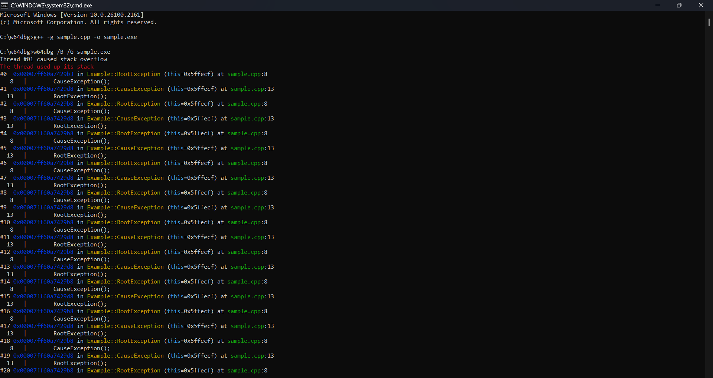
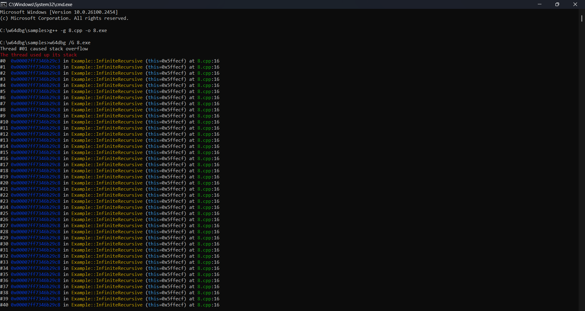

# __w64dbg__

A high-performance debugging utility for x64 Windows executables with PDB and DWARF debug formats support.

## __Download__

* [__Latest release__](https://github.com/vxtan27/w64dbg/releases/latest)
* [__Git Repository__](./)

## __Installation__

1. Download and extract the archive.
2. Run the included `setup.bat` script.

## __Usage__

    
    W64DBG [options] <executable> [exec-args]
    
    Description:
        A debugging utility for x64 Windows executables.
        
    Entries:
        options       Options control debugging behavior.
        executable    Target executable file to debug.
        exec-args     Arguments passed to the executable.
        
    Options:
        /B            Ignore breakpoints.
        /D            Load PDB debug symbols.
        /G[+]         Load DWARF debug symbols.
        /O            Suppress OutputDebugString.
        /S            Run the executable in a new console.
        /T            Wait for a specified time (seconds).
        /V<n>         Set verbosity level for debug output.
    

## __Examples__

    

        <b>
            MSVC Compiler
        </b>
    

     
    

    

        <b>
            MinGW Compiler
        </b>
    

     
    

See [__here__](samples) for more samples.

## __Requirements__

### __System Requirements__

Windows version: **Windows 7+**

System type: **64-bit operating system, x64-based processor**

**NOTE**: Debugging x86 executables is supported on Windows 10+

### __Dynamic link libraries__

|       DLL        |       Location       |             Description              |
| ---------------- | -------------------- | ------------------------------------ |
| ntdll.dll        | C:\Windows\System32  | Windows Native API                   |
| kernel32.dll     | C:\Windows\System32  | Windows Core API                     |
| msvcrt.dll       | C:\Windows\System32  | Microsoft Visual C++ Runtime         |
| ucrtbase.dll     | C:\Windows\System32  | Universal C Runtime                  |
| vcruntime140.dll | C:\Windows\System32  | Microsoft Visual C++ Redistributable |
| dbghelp.dll      | C:\Windows\System32  | Debugging Tools For Windows          |

**NOTE**: Missing DLLs can be downloaded from trusted sources.

## __Limitations__

w64dbg supports up to 32 threads and 16 DLLs. These limits align with typical debugging use cases.

## __Frequently Asked Questions__

    

        <b>
            How do I configure MSVC for debugging?
        </b>
    

Use the following options to debug with MSVC:

|     Option      | MSVC-Optimized |   Debug info level   |
| --------------- | -------------- | -------------------- |
| /DEBUG          | Yes            | Standard             |
| /DEBUG:FULL     | Yes            | Maximum              |
| /DEBUG:FASTLINK | Yes            | Reduced              |
| /Z7             | Yes            | Basic                |
| /Zi             | Yes            | Standard             |
| /OPT:NOREF      | No             | Enhanced symbol info |
| /OPT:NOICF      | No             | Enhanced symbol info |

For more information:

* [__Generate debug info__](https://learn.microsoft.com/cpp/build/reference/debug-generate-debug-info)
* [__Debug Information Format__](https://learn.microsoft.com/cpp/build/reference/z7-zi-zi-debug-information-format)
* [__Optimizations__](https://learn.microsoft.com/cpp/build/reference/opt-optimizations)

    

        <b>
            How do I configure MinGW for debugging?
        </b>
    

Use the following options to debug with MinGW:

| Option | Macro info | GDB-Optimized | Debug info level |
| ------ | ---------- | ------------- | ---------------- |
| -g     | No         | No            | Basic            |
| -g3    | Yes        | No            | Maximum          |
| -ggdb  | No         | Yes           | Basic            |
| -ggdb3 | Yes        | Yes           | Maximum          |

See [__this__](https://gcc.gnu.org/onlinedocs/gcc/Debugging-Options.html#index-g) for more information.

`-fno-omit-frame-pointer`: Retain the frame pointers.

See [__this__](https://gcc.gnu.org/onlinedocs/gcc/Optimize-Options.html#index-fomit-frame-pointer) for more information.

    

        <b>
            Where should I place *.pdb files?
        </b>
    

Place `*.pdb` files alongside the executable or configure symbol paths via `_NT_ALT_SYMBOL_PATH` or `_NT_SYMBOL_PATH`

See [__this__](https://learn.microsoft.com/windows-hardware/drivers/debugger/general-environment-variables) for more information.

    

        <b>
            How do I use breakpoints effectively?
        </b>
    

Breakpoints are a critical debugging technique, allowing you to pause execution at specific points in your code. On Windows, use the `DebugBreak()` API to trigger breakpoints.

See [__this__](https://learn.microsoft.com/visualstudio/debugger/using-breakpoints) for more information.

    

        <b>
            How can I access errno for a specific thread?
        </b>
    

`errno` is a thread-local variable, its pointer is retrieved through the `_errno()` function, defined as:

    
    _ACRTIMP int* __cdecl _errno(void);
    #define errno (*_errno())
    

Thus, you cannot directly access the errno value for a specific thread.

## __Other links__

* [__Microsoft PDB format__](https://github.com/Microsoft/microsoft-pdb/blob/master/docs/ExternalResources.md)
* [__Microsoft DbgHelp library__](https://learn.microsoft.com/windows/win32/debug/debug-help-library)
* [__Experimental use of DbgHelp__](https://debuginfo.com/articles.html)
* [__Showing Variables Using the Windows Debugging API__](https://accu.org/journals/overload/29/165/orr)
* [__Other Debugging Tools for Windows__](https://learn.microsoft.com/windows-hardware/drivers/debugger/debugger-download-tools)

## __License__

w64dbg is licensed under the BSD-3-Clause license.

See [__LICENSE__](LICENSE) for more details.